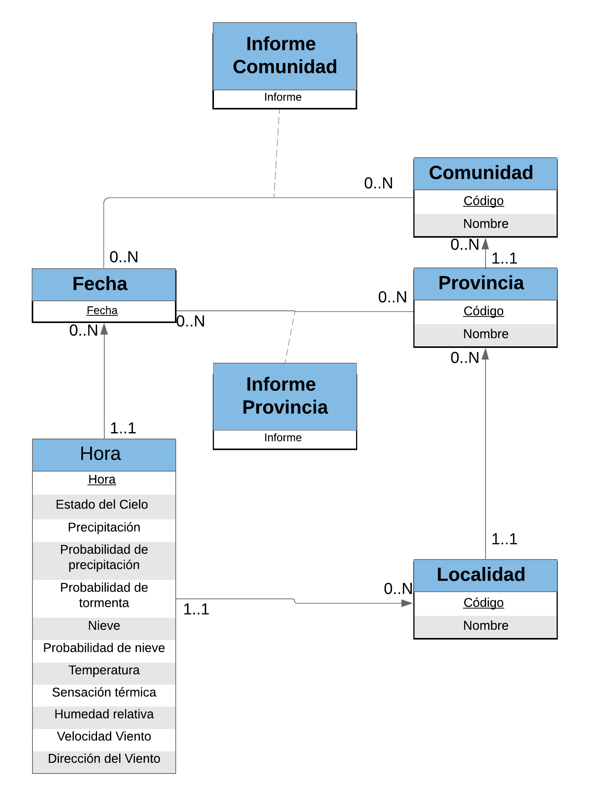

# Análisis y propuestas de técnicas de Procesamiento de Lenguaje Natural para redactar informes meteorológicos

Este proyecto se corresponde a mi trabajo fin de grado, a ser mi primer proyecto con Python, NLP y Machine Learning y con el tiempo establecido del trabajo hay cosas muy optimizables, además de ficheros que están en los directorios que no se usan en el fichero pero lo tengo como experimientos realizados.

## Resumen

El crecimiento de datos en la red va en aumento cada año. Uno de los sectores afectados es el campo meteorológico donde analizan datos hora a hora e incluso minuto a minuto. Estos datos tienen que ser analizados por meteorólogos para el fin de traducirlos a los ciudadanos.

Este proyecto va orientado a este fin, recoger una serie de datos de entrada con valores meteorológicos y transformar estos datos en texto en un lenguaje entendible para un ser humano. Para la transformación de datos a texto se va a utilizar la tecnología denominada Procesamiento de Lenguaje Natural.

Para tratar este proceso este proyecto se ha dividido en tres partes. La primera parte orientada al formato y recogida de datos donde se detalla como son los datos y como se han recogido. Una segunda parte donde se explica la arquitectura llevada para el análisis de datos recogidos en la primera parte. Por ultimo la tercera y última parte consta de una comparación entre los informes reales con los informes realizados automáticamente.

## Partes del programa

### Recogida de datos

La primera parte se corresponde a la recogida de datos. Los datos recogidos se a realizado a través de la api de AEMET https://opendata.aemet.es/. Los datos necesario para la recogida del corpus se correstonde a informes redactadas por humanos y datos asociados a estos informes.

La recogida de datos ha sido constante a través de dos meses. Los datos recogidos se guardaba en una base de datos SQL:

### Creciaón del informe

Para la creación del informe he creado la siguiente arquitectura:

La arquitectura esta compuesta por tres niveles:

- **Clasificador**: el nivel más bajo se corresponde a un clasificador de machine learning (modelo: https://scikit-learn.org/stable/modules/generated/sklearn.linear_model.SGDClassifier.html). El entrenamiento ha sido con los textos de los datos recogidos. Para el entrenamiento se ha hecho una segmentación de frases a través de NLP y se ha creado categorias por frase. Estas categorias son: nubosidad, precipitación, viento, humedad y temperatura. De esta manera se puede recoger caracteristicas de cada categoria.
- **PLN**: el nivel intermedio se basa en la creación de frases a través de un estudio con NLP para realizar las frases.
- **GLN**: a través de las reglas creadas se forma el informe final.

## Directorios del proyecto

- **Dataset**: este directorio se corresponde a la recogida de los datos. El archivo principal es Main.py donde llama a la Api y lo lleva a la BBDD.
- **BBDD**: directorio que esta todas las funciones de la base de datos, tanto las querys que se utilizan como la creación de estas.
- **AnalisisTexto**: directorio que esta distintos modelos de Machine Learning como Bayes, SVM, SVM multilabel. Además de la creación del archivo de .csv para el entrenamiento de estos. Por otro lado tambien esta los analisis del texto donde se ve palabras mas usuales, nubes de palabras, etc...
- **Datos**: directorio donde se crea las oraciones a través de los analisis de texto realizado previamente.
- **textos**: se encuentra los textos recogiodos, además de los .csv con los que he entrenado y etiquetado.

